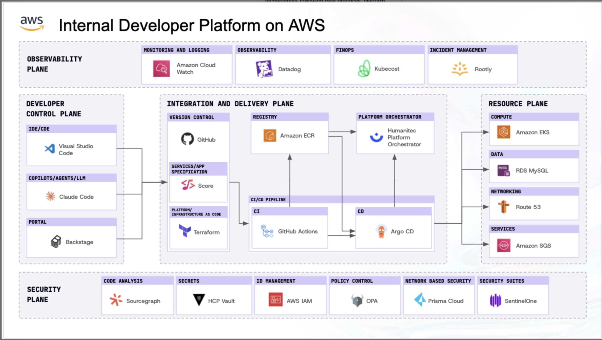
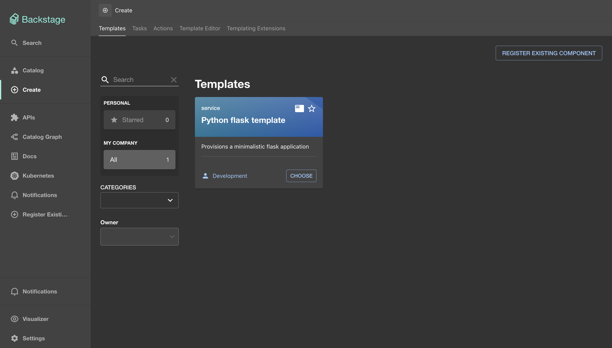
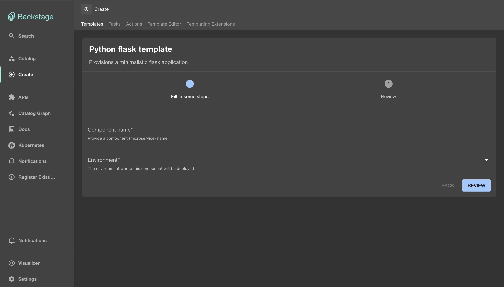

# Internal Developer Platform on AWS

An Internal Developer Platform (IDP) built on AWS, combining Backstage as the developer portal with GitOps-based deployments via ArgoCD, infrastructure provisioning via Terraform, and golden-path software templates for teams to self-serve new services.

## Architecture



The platform is organized into four planes:

| Plane | Components |
|---|---|
| **Developer Control Plane** | Backstage portal, Visual Studio Code, Claude Code |
| **Integration & Delivery Plane** | GitHub (source), Amazon ECR (registry), GitHub Actions (CI), ArgoCD (CD), Terraform (IaC), Score (service spec) |
| **Resource Plane** | Amazon EKS (compute), RDS MySQL (data), Route 53 (networking), Amazon SQS (services) |
| **Observability Plane** | Amazon CloudWatch, Datadog, Kubecost, Rootly |
| **Security Plane** | Sonarqube, HCP Vault, AWS IAM, OPA, Prisma Cloud, SentinelOne |

## Repository Structure

```
.
├── backstage-app/backstage/        # Backstage developer portal (TypeScript)
│   ├── packages/app/               # React frontend
│   ├── packages/backend/           # Node.js backend
│   ├── catalog/entities/           # User & group YAML definitions
│   ├── charts/                     # Kubernetes manifests for Backstage itself
│   └── app-config*.yaml            # Config (base / local / production)
├── backstage-software-templates/   # Backstage scaffolder templates
│   └── python-application/         # Python Flask golden-path template
│       ├── template.yaml           # Template spec (parameters & steps)
│       └── template/               # Cookiecutter-style files
└── terraform/                      # AWS infrastructure (VPC + EKS)
```

## Prerequisites

- Node.js 22 or 24
- Yarn 4.4.1 (Berry)
- AWS CLI configured with appropriate credentials
- Terraform ≥ 1.0
- `kubectl` and `helm` for cluster operations

## Getting Started

### 1. Provision AWS Infrastructure

```bash
cd terraform
terraform init
terraform apply
```

This creates a VPC and an EKS cluster (`eks-cluster`, Kubernetes 1.33) in `eu-west-2` using EKS Auto Mode.

### 2. Run the Backstage Portal Locally

```bash
cd backstage-app/backstage
```

Set required environment variables:

```bash
export GITHUB_TOKEN=<your-github-pat>
export AUTH_GITHUB_CLIENT_ID=<your-oauth-app-client-id>
export AUTH_GITHUB_CLIENT_SECRET=<your-oauth-app-client-secret>
```

Install dependencies and start:

```bash
yarn install
yarn start
```

The frontend is available at `http://localhost:3000` and the backend at `http://localhost:7007`. Local development uses an in-memory SQLite database — no PostgreSQL setup needed.

### 3. Deploy Backstage to EKS

Build and push the backend image:

```bash
yarn build:backend
yarn build-image
```

Apply the Kubernetes manifests:

```bash
kubectl apply -f backstage-app/backstage/charts/backstage.yaml
kubectl apply -f backstage-app/backstage/charts/values-postgres.yaml
```

## Software Templates

Templates allow developers to self-serve new services directly from the Backstage portal without manual setup.

### Python Flask Template



Selecting the **Python flask template** opens a short form to configure the new service:



| Parameter | Description |
|---|---|
| **Component name** | Name of the microservice (used as the repo name, Helm release name, and ArgoCD app name) |
| **Environment** | Target deployment environment (`dev` or `prod`) |

Clicking **Review** then **Create** triggers the scaffolder, which:

1. Generates a complete project from the template (Flask app, Dockerfile, Helm chart, Terraform for ECR, GitHub Actions workflows)
2. Publishes it as a new GitHub repository under `github.com/olaolatunbosun/<component-name>`
3. Registers the new component in the Backstage catalog

### Generated Service CI/CD Pipeline

Each generated service ships with two GitHub Actions workflows:

- **`*-infra.yaml`** — Runs on changes to `terraform/`. Provisions the ECR repository via `terraform apply`.
- **`*-cicd.yaml`** — Runs on changes to `src/`. Builds and pushes the Docker image to ECR, then deploys to EKS via ArgoCD (requires a self-hosted runner registered on the cluster and `ARGOCD_PASSWORD` set as a GitHub secret).

## Configuration

Backstage config is layered:

| File | Used when |
|---|---|
| `app-config.yaml` | Always (base defaults, SQLite in-memory DB) |
| `app-config.local.yaml` | Local development (GitHub auth, catalog URLs) |
| `app-config.production.yaml` | Production (PostgreSQL, GitHub OAuth, `/app/entities/` catalog paths) |

Production environment variables required in the container:

| Variable | Purpose |
|---|---|
| `GITHUB_TOKEN` | GitHub PAT for catalog and scaffolder |
| `AUTH_GITHUB_CLIENT_ID` | GitHub OAuth App client ID |
| `AUTH_GITHUB_CLIENT_SECRET` | GitHub OAuth App secret |
| `POSTGRES_HOST` | PostgreSQL host |
| `POSTGRES_USER` | PostgreSQL username |
| `POSTGRES_PASSWORD` | PostgreSQL password |
